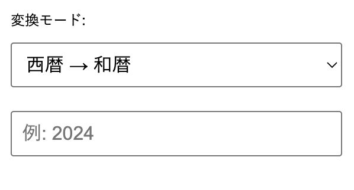

# 📆 和暦⇔西暦変換ツール（Chrome拡張）

- 西暦と和暦（明治・大正・昭和・平成・令和）を相互に変換できるシンプルな Chrome 拡張です。  
- 入力ミスを防ぐため、和暦モードでは「元号」をプルダウンから選択、年数は手入力に対応。  
- 日本の行政書類や履歴書などで必要になる変換を、手軽に行えます。

---

## 🧩 機能概要

- **西暦 → 和暦**（例: 2024 → 令和6年）
- **和暦 → 西暦**（例: 平成3年 → 1991年）
- 入力形式は自動切替
  - 和暦モード：元号を選択式、年数は手入力
  - 西暦モード：4桁の数字を手入力
- 即時に変換結果を表示

---

## 🖥️ スクリーンショット


---

## 🔧 インストール方法（開発者モード）

1. このリポジトリをクローン or ZIPでダウンロードし、展開する
2. Chromeで `chrome://extensions/` を開く
3. 右上の「デベロッパーモード」をON
4. 「パッケージ化されていない拡張機能を読み込む」をクリックし、展開したフォルダを選択
5. 拡張機能がツールバーに追加されます

---

## 📂 ファイル構成
```
wareki-converter/
├── manifest.json
├── popup.html
├── popup.js
├── icon16.png
├── icon48.png
├── icon128.png
```
---

## 📌 使用上の注意

- 和暦は明治元年（1868）〜令和（2019〜）に対応
- 年数の上限・下限チェックは最低限に留めています
- 将来的に「令和元年」表記や、変換履歴保存機能などの追加も検討中

---

## 🛠 今後の展望（ToDo）

- ダークモード対応
- 元号の表示を「元年」形式にも対応（例：令和元年）
- オフライン変換履歴の保存
- ストア公開版（署名＆提出）

---

## 📄 ライセンス

MIT License